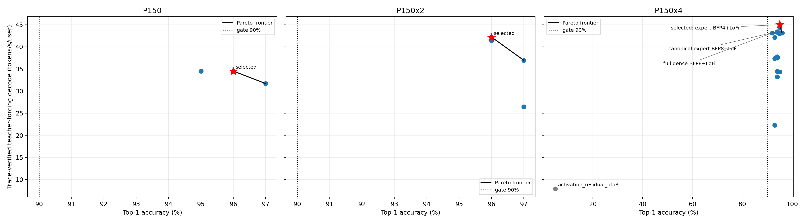
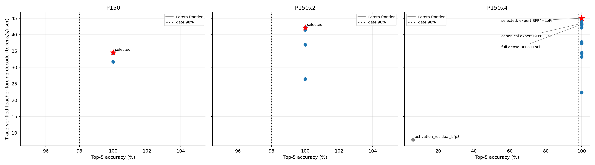

# Gemma-4-26B-A4B-it datatype sweep

## Selected policy

`selected_canonical_profile_policy` is the consumed default for P150,
P150x2, and P150x4. `tt/precision_policy.py` loads
`selected_precision_config.json` when no override is supplied, resolves the
profile, and passes the result into the full-model constructor. The accuracy
gate is top-1 >= 90%, top-5 >= 98%, and top-100 = 100% on the pinned AIME24
chat-template reference with 100 generated tokens.

| Profile | Top-1 | Top-5 | Top-100 | readiness TTFT (ms) | traced teacher decode t/s/u | warmed prefill (ms) | post-select token-out t/s/u |
| --- | ---: | ---: | ---: | ---: | ---: | ---: | ---: |
| P150 | 96% | 100% | 100% | 352.135 | 34.508 | 148.127 | 37.256 |
| P150x2 | 96% | 100% | 100% | 271.633 | 42.139 | 126.560 | 46.531 |
| P150x4 | 95% | 100% | 100% | 254.922 | 45.015 median | 102.998 | 52.202 |

Every readiness run has 99 trace replays. Teacher-forcing performance includes
the required host prediction readback and teacher-token feedback. The TP4
ranking value is the median of 45.613, 45.015, and 44.987 t/s/u. Token-out is
reported separately: B1, prompt length 128, five warmups, 128 timed tokens,
traced on-device sampling/feedback, and zero timed token readbacks.

The selected precision fields are:

- BF16 norms, activations, residuals, CCL, KV cache and updates, logits, and
  sampling parameters;
- BF16 row-major embedding and BFP8_B vocabulary-sharded LM head;
- BF16 sliding-attention QKV/O, BFP8_B full-attention QKV/O;
- BFP8_B sliding dense gate/up/down and BF16 full-attention dense
  gate/up/down;
- P150: BFP8_B experts except BFP4_B gate/up in the five full-attention layers;
- P150x2: BFP8_B expert gate/up/down;
- P150x4: BFP4_B expert gate/up/down and BFP8_B packed dense decode copy;
- HiFi4 sliding attention, HiFi2 full attention, and LoFi dense/expert
  matmuls; FP32 router projection/scales and uint32 token IDs.

The embedded live `precision_summary` proves consumption for every measured
default path: actual tensor dtypes, prefill/decode fidelities, embedding,
LM-head, cache, CCL, logits, sampling assumptions, and independent decode
copies. Explicit dense policy values take precedence over layer fallbacks,
and packed expert gate/up matmuls consume the independent gate/up fidelity.
Unsupported FP32 cache-update policy is rejected instead of being echoed.

## Baseline and Pareto result

The refreshed optimized canonical baseline measured 96/96/94% top-1,
100% top-5/top-100, and 34.522/41.472/43.431 traced teacher t/s/u for
P150/P150x2/P150x4. The selected P150 and P150x2 policies are runtime-equivalent
to that canonical policy; their separate refreshes differ by 0.04% and 1.61%
respectively and do not represent a precision-policy change. TP4's all-expert
BFP4+LoFi policy is a repeatable material win.

The 28 full-model rows are plotted below. Each profile has its Pareto frontier,
the selected point is a red star, and the minimum accuracy is a vertical dotted
line. Principal TP4 competitors are labeled.

The selected policy is the fastest measured passing consumed policy per
profile. The superficially faster P150 canonical point is the same effective
policy (34.522 versus 34.508 t/s/u); the P150x2 packed-copy candidate is a
profile-inapplicable no-op, not a distinct consumed precision policy.

## Candidate interpretation

| Candidate/profile | Top-1 / Top-5 / Top-100 | traced teacher t/s/u | disposition |
| --- | --- | ---: | --- |
| activation/residual BFP8, TP4 | 5% / 6% / 27% | 7.902 | accuracy fail |
| KV BFP8, TP4 | 93% / 100% / 100% | 22.317 | pass, much slower |
| CCL BFP8, TP4 | 93% / 100% / 100% | 42.113 | pass, slower |
| full dense BFP8+LoFi, TP4 | 92% / 100% / 100% | 43.145 | pass, consumed after precedence fix, slower |
| full dense BFP8+HiFi2, TP4 | 95% / 100% / 100% | 42.987 | pass, consumed after precedence fix, slower |
| expert BFP8+HiFi2, TP4 | 93% / 100% / 100% | 37.343 | pass, slower than BFP8+LoFi control |
| all-expert BFP4+HiFi2, TP4 | 95% / 100% / 100% | 44.349 | pass, slower than LoFi |
| all-expert BFP4+LoFi, TP4 | 95% / 100% / 100% | 45.015 median | selected for P150x4 |
| all-expert BFP4+LoFi, P150/P150x2 | 97% / 100% / 100% | 31.692 / 26.449 | pass, profile regressions |

The remaining evaluated points cover sliding attention BFP8 at HiFi4/HiFi2/
LoFi, full-attention decode LoFi, isolated expert-down BFP4+LoFi,
dense-down BFP4+LoFi, and packed dense gate/up BFP4 at LoFi/HiFi2. Every
material BFP4 group has a LoFi result. Both BFP4 and canonical BFP8 expert
groups have corresponding HiFi2 controls after the expert fidelity consumer
was fixed.

## Capacity, prompts, and qualitative evidence

The selected KV cache remains BF16 and does not change cache layout, trace
buffers, or prefill chunking. `../context_contract.json` was recomputed and
preserves P150=50,624 and P150x2/P150x4=262,144 tokens. P150 is limited by
physical DRAM; weight quantization makes it feasible without reducing that
proven maximum. Because selected cache dtype/layout/chunking are unchanged,
the current-head non-aligned checks at 50,623/262,143/262,143 remain valid.

The final TP4 BFP4 policy passed the fresh six-prompt suite with the pinned
Gemma chat template, matching HF controls, greedy 64-token generation, and a
reset between requests. The mechanical degeneracy checker reported no
findings. A separate `TT_METAL_TRACE_ALLOC_TRACKING=1` P150 run completed 134
replays and zero readbacks without an unsafe-allocation failure; diagnostic
overhead is excluded from performance results.

Hardware was four local P300C Blackhole devices used as P150-family proxies,
firmware 19.13.1 and KMD 2.8.0. No silicon performance claim is made beyond
that measured system. No vLLM integration work is part of this stage.

## Artifacts

- `selected_precision_config.json`: default, consumed per-profile policy.
- `sweep_results.json` / `sweep_results.csv`: policies, fidelities, accuracy,
  TTFT, traced teacher performance, exact commands, hardware/mesh, verdicts,
  consumption summaries, repetitions, and post-selection results.
- `top1_perf_pareto.png` / `top5_perf_pareto.png`: checked Pareto charts.
- `artifacts/selected_default_readiness/`: final three-profile AIME24 evidence.
- `artifacts/selected_token_out/`: final no-readback performance and prefill.
- `artifacts/trace_allocation_tracker_check/`: enforced trace-lifetime check.
- `artifacts/selected_qualitative/`: final prompt suite and checker verdict.
- `configs/`, `artifacts/repeats/`, and candidate directories: rejected policy
  definitions, raw full-model results, and finalist repetitions.
- `work_log.md`: commands, defects, decisions, limitations, review, and commit.
