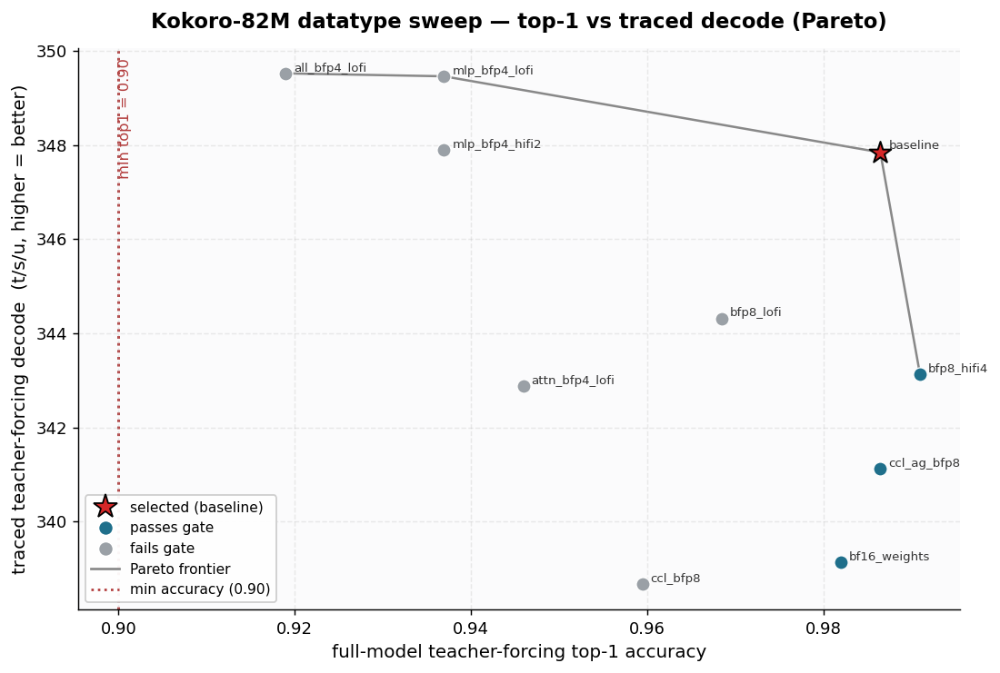
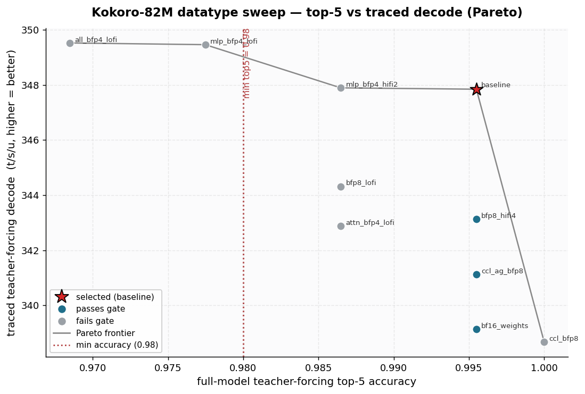

# Kokoro-82M — Datatype Sweep (stage 07)

Stage 07 (datatype-sweep) for `hexgrad/Kokoro-82M` on **4× Blackhole p300c**
(`ClusterType.P300_X2`, physical 4-ring exposed as a `(1,4)` mesh). Starting from
the completed optimized full model (stage 06), this stage evaluates a
weight / activation / CCL / compute-fidelity candidate matrix and selects the
**fastest config that satisfies the full-model accuracy + output-fidelity gate**,
ranked by trace-verified teacher-forcing decode t/s/u.

## Selected config

**`baseline` — attn/mlp/map weights BFP8, activations bf16, matmul+SDPA HiFi2,
fp32 dest-acc, LayerNorm HiFi4, CCL (all_gather + reduce_scatter) bf16, readout/
logits bf16, greedy on-device argmax.**

This is the canonical BFP8/HiFi2 policy carried from stage 02 and re-validated here
at the **full-model** level. It is written to
[`selected_precision_config.json`](selected_precision_config.json) and is loaded by
default through `tt/precision_config.load_selected` → `build_generator` (proven
consumed by [`propagation_check.json`](propagation_check.json)).

| Metric (selected config) | Value |
|---|---|
| last_hidden_state PCC vs HF (min, incl. non-aligned) | **0.996999** (bar 0.995 ✓) |
| Prefill reconstruction top-1 / top-5 / top-100 | **1.000 / 1.000 / 1.000** |
| Teacher-forcing top-1 / top-5 / top-100 | **0.9865 / 0.9955 / 1.000** (bars 0.90 / 0.98 ✓) |
| **Trace-verified teacher-forcing decode** (ranking metric) | **347.8 t/s/u** |
| Teacher-forcing TTFT | 16.2 ms |
| **Post-selection token-out decode** (serving headline, default path) | **560 t/s/u @T128 · 395 t/s/u @T512** |
| Post-selection eager TTFT @128 | 10.7 ms |

Post-selection token-out is measured through the normal `build_generator`
selected-config path (no explicit policy) and recorded separately in
[`post_selection_tokenout.json`](post_selection_tokenout.json). **Later reports and
vLLM comparisons should use this token-out number.**

## Thresholds (acceptance gate)

- **top-1 ≥ 0.90**, **top-5 ≥ 0.98** (skill defaults; user gave no override).
- **top-100** kept at the existing readiness expectation (**1.0**).
- **last_hidden_state PCC ≥ 0.995 vs HF** — the model-specific output-fidelity bar
  carried unchanged from stages 01–06. Kokoro is a TTS model whose *real* output is
  `last_hidden_state` (it feeds the prosody predictor + ISTFTNet vocoder); the
  reconstruction top-1/5/100 is a derived MLM-style proxy. A config that keeps the
  top-k proxy but drops `last_hidden_state` PCC below 0.995 degrades the actual TTS
  signal, so PCC is gated in addition to top-k.

Ranking metric for the Pareto frontier and final selection: **trace-verified
teacher-forcing decode t/s/u** (`run_teacher_forcing`, `enable_trace=True`). Eager /
untraced numbers are never used for ranking or selection.

## Candidate matrix & results

Full-model accuracy (222 reconstructed positions over IPA phoneme references,
K=100) + trace-verified TF decode + warmed min-of-N traced token-out, one device
job per candidate. `attn/mlp/map` = weight dtype per group; `ccl` = all_gather /
reduce_scatter payload dtype.

| id | status | attn/mlp/map | mm_fid | ccl(ag/rs) | PCC min | TF top-1 | TF top-5 | TF decode t/s/u | token-out T128 / T512 t/s/u |
|---|---|---|---|---|---|---|---|---|---|
| **baseline** ⭐ | **pass** | bfp8/bfp8/bfp8 | HiFi2 | bf16/bf16 | **0.99700** | 0.9865 | 0.9955 | **347.8** | **558.9 / 392.3** |
| bf16_weights | pass | bf16/bf16/bf16 | HiFi2 | bf16/bf16 | 0.99893 | 0.9820 | 0.9955 | 339.1 | 537.6 / 380.5 |
| bfp8_hifi4 | pass | bfp8/bfp8/bfp8 | HiFi4 | bf16/bf16 | 0.99724 | 0.9910 | 0.9955 | 343.1 | 534.1 / 389.3 |
| ccl_ag_bfp8 | pass | bfp8/bfp8/bfp8 | HiFi2 | bfp8/bf16 | 0.99805 | 0.9865 | 0.9955 | 341.1 | 542.4 / 394.7 |
| bfp8_lofi | fail | bfp8/bfp8/bfp8 | **LoFi** | bf16/bf16 | **0.99283** | 0.9685 | 0.9865 | 344.3 | 564.4 / 395.2 |
| mlp_bfp4_lofi | fail | bfp8/**bfp4**/bfp8 | LoFi | bf16/bf16 | **0.92085** | 0.9369 | **0.9775** | 349.5 | 564.6 / 400.8 |
| mlp_bfp4_hifi2 | fail | bfp8/**bfp4**/bfp8 | HiFi2 | bf16/bf16 | **0.92778** | 0.9369 | 0.9865 | 347.9 | 560.5 / 398.2 |
| attn_bfp4_lofi | fail | **bfp4**/bfp8/bfp8 | LoFi | bf16/bf16 | **0.96273** | 0.9459 | 0.9865 | 342.9 | 558.2 / 396.7 |
| all_bfp4_lofi | fail | **bfp4/bfp4/bfp4** | LoFi | bf16/bf16 | **0.93074** | **0.9189** | **0.9685** | 349.5 | 568.9 / 400.9 |
| ccl_bfp8 | fail | bfp8/bfp8/bfp8 | HiFi2 | **bfp8/bfp8** | **0.98962** | 0.9595 | 1.000 | 338.7 | 525.1 / 389.4 |

Bolded metrics are the gate-failing values. Full data:
[`sweep_results.json`](sweep_results.json) / [`sweep_results.csv`](sweep_results.csv);
per-candidate detail (incl. `dtype_summary` propagation readback) in
[`candidates/`](candidates/).

## Pareto interpretation




- Y-axis = trace-verified teacher-forcing decode t/s/u (higher = better). X-axis =
  full-model TF top-1 (resp. top-5). The dotted red line is the minimum allowed
  accuracy (0.90 / 0.98). The red ★ is the selected config.
- **The model is launch/dispatch-bound, not matmul-bound** (stage 06: ~5% DRAM
  utilization, ~1 µs op-to-op gaps). Reducing weight precision or fidelity shrinks
  DRAM traffic that is *not* the binding constraint, so it buys **at most ~1–2%**
  on token-out and **nothing** reliable on traced TF decode — while it measurably
  erodes `last_hidden_state` fidelity. That is exactly the shape of the frontier:
  the fast upper-left points (all_bfp4_lofi, mlp_bfp4_lofi) are **gate-failing**
  (gray), and every gate-*passing* point (teal) sits at ≤ baseline speed.
- The selected ★ is the fastest **gate-passing** point on both charts. Three raw
  points nominally exceed baseline on the traced-TF-decode axis — mlp_bfp4_lofi
  349.5, all_bfp4_lofi 349.5 (both +~0.5%), and mlp_bfp4_hifi2 347.89 (+0.014%, i.e.
  *within measurement noise*) — but all three fail the accuracy/fidelity gate
  (mlp_bfp4_lofi/all_bfp4_lofi fail top-5 0.9775/0.9685 *independently of PCC*;
  mlp_bfp4_hifi2 fails PCC 0.928 with top-5 exactly at the 0.9865 margin), so none is
  admissible. Note the entire 10-config traced-TF-decode spread is 338.7–349.5 t/s/u
  (±1.5%), which is itself the launch-bound signature: weight precision barely moves
  the binding metric. On the more stable token-out metric, baseline is also the
  fastest passing config (558.9 vs bf16 537.6 / HiFi4 534.1 / ccl_ag 542.4).
- **Even under a hypothetical top-1/top-5-only gate (PCC dropped), baseline stays
  the correct pick:** it is the fastest gate-passing config except for mlp_bfp4_hifi2,
  which is within 0.014 % (noise) and is the strictly less-safe choice (BFP4 MLP,
  PCC 0.928), so the "within-noise → prefer simpler/safer" tiebreak selects baseline
  regardless.

## Rejected configs (evidence)

All rejections are on **real Kokoro weights** at the **full-model** level (not
synthetic/representative-semantics PCC), and every rejected config **ran cleanly**
on device (no TTNN/runtime blocker → no `$autofix` needed; these are genuine
accuracy rejections):

- **bfp8_lofi** — LoFi matmul fidelity on BFP8 weights: PCC 0.99283 < 0.995 and
  TF top-1 0.9685. LoFi is ~1% faster on token-out but fails the fidelity bar. (The
  mandated BFP8+LoFi vs BFP8+HiFi2 fidelity comparison for the dominant projections.)
- **bfp8_hifi4** — passes, but +HiFi4 is *slower* than HiFi2 (343.1 vs 347.8 TF
  decode; 534 vs 559 token-out) for +0.0002 PCC. No benefit → rejected in favor of
  HiFi2. (Confirms HiFi2 is the right fidelity for BFP8 here.)
- **mlp_bfp4_lofi / mlp_bfp4_hifi2** — BFP4 MLP (FF1+FF2) weights: PCC collapses to
  0.921 / 0.928 and TF top-5 0.9775 / 0.9865. Required BFP4+LoFi *and* BFP4+HiFi2
  candidates for the MLP group; both fail. HiFi2 recovers a little PCC over LoFi but
  not enough.
- **attn_bfp4_lofi** — BFP4 attention (QKV+dense) weights + LoFi: PCC 0.9627 < 0.995
  (attention tolerates BFP4 better than MLP, but still fails). Required BFP4+LoFi
  candidate for the attention group.
- **all_bfp4_lofi** — all linear weights BFP4 + LoFi: PCC 0.931, TF top-1 0.919,
  top-5 0.9685; the fastest raw config but fails every bar. Covers the map group's
  BFP4+LoFi.
- **bf16_weights** — passes with the best PCC (0.99893) but is the *slowest* config
  (BFP8 halves weight DRAM traffic and is ~4% faster); rejected as unnecessary
  precision.
- **ccl_bfp8** — BFP8 both collectives: reduce_scatter-in-BFP8 drops PCC to 0.9896
  and is slower at T=128 (525 vs 559 token-out). **ccl_ag_bfp8** (all_gather BFP8
  only, RS bf16) passes (PCC 0.9981) but is slower than baseline on the ranking
  metric (341.1 < 347.8) and at T=128 (542 < 559); bf16 CCL kept.

Every material **BFP4** matmul group considered (MLP, attention, map) has a
**BFP4+LoFi** candidate (`mlp_bfp4_lofi`, `attn_bfp4_lofi`, `all_bfp4_lofi`), and
the MLP group additionally has the BFP4+HiFi2 comparison — satisfying the skill's
BFP4+LoFi requirement. No BFP4 group is selected.

## Compute fidelity (per material matmul group)

| group | dtype | fidelity swept | selected | reason |
|---|---|---|---|---|
| MLP FF1/FF2 (dominant decode matmul) | BFP8 | LoFi / HiFi2 / HiFi4; BFP4+LoFi; BFP4+HiFi2 | **BFP8 + HiFi2** | LoFi fails PCC; BFP4 fails PCC hard; HiFi4 slower for no gain |
| attention QKV/dense | BFP8 | HiFi2; BFP4+LoFi | **BFP8 + HiFi2** | BFP4 fails PCC (0.963) |
| embed→hidden map | BFP8 | HiFi2; BFP4 (via all_bfp4) | **BFP8 + HiFi2** | tiny op; BFP4 fails as part of all_bfp4 |
| SDPA | (bf16 act) | HiFi2 | **HiFi2** | not a dominant cost; kept at HiFi2 |
| LayerNorm | bf16 | HiFi4 | **HiFi4** | cheap; fidelity kept for accuracy |

`fp32_dest_acc=True` is required for BFP8 short-length PCC (stage 02 evidence) and
kept. The selected fidelities are proven consumed by the measured runtime path:
[`propagation_check.json`](propagation_check.json) reads the real device tensor
dtypes and kernel-config fidelities and matches them to the selected config
(`all_consumed: true`); stage-06 `tt-perf-report` rows show BFP8/HiFi2 in the
dominant matmul rows for the same policy
(`../optimized_full_model/tracy/tokenout_perf_report.txt`).

## KV-cache / context / non-aligned

- **KV-cache dtype = N/A** (0 bytes): Kokoro's plbert is a non-autoregressive,
  bidirectional, stateless encoder — no KV cache / paged cache / current-position
  state. There is no KV-cache dtype axis and no candidate that changes memory
  capacity via a KV cache, so no context recomputation from a KV-cache dtype change
  is required.
- **Context 512 preserved** (advertised = supported), `capability_reduction=false`.
  The selected config introduces no dtype/layout change vs optimized_full_model, so
  memory and context are unchanged. All swept lower-precision candidates would
  *reduce* per-device memory, so none is rejected for capacity. See
  `../context_contract.json → datatype_sweep`.
- **Non-aligned prompt support preserved**: the selected config uses baseline
  dtype/layout, so internal padding to TP*TILE=128 and SDPA masking/chunking are
  unchanged. Re-validated through the default selected-config path at lengths
  31/33/127/200/511 (all PCC ≥ 0.9970): [`non_aligned_check.json`](non_aligned_check.json).

## Reproduce

```bash
ENV="TT_METAL_HOME=/home/ttuser/dev/tt-metal PYTHONPATH=/home/ttuser/dev/tt-metal/ttnn:/home/ttuser/dev/tt-metal"
D=models/autoports/hexgrad_kokoro_82m/doc/datatype_sweep

# refresh the shared readiness references (IPA phoneme reconstruction, K=100, 222 gen tokens):
env $ENV python models/autoports/hexgrad_kokoro_82m/doc/full_model/make_references.py
# full candidate matrix (one device job per candidate) + aggregate:
env $ENV python $D/sweep_driver.py
# one candidate:
env $ENV python $D/run_candidate.py --id baseline --spec '{"policy":{},"opt":{}}'
# prove the selected config is consumed by the default build_generator path:
env $ENV python $D/propagation_check.py
# Pareto charts:
python $D/make_plots.py
# post-selection token-out (default path) + non-aligned check:
env $ENV python $D/post_selection.py
# context-contract gate:
env $ENV python .agents/scripts/check_context_contract.py --model-dir models/autoports/hexgrad_kokoro_82m --stage datatype-sweep
# tests (19):
env $ENV python -m pytest models/autoports/hexgrad_kokoro_82m/tests/test_full_model.py -q
```

## Artifacts

- [`selected_precision_config.json`](selected_precision_config.json) — selected policy
  (weight groups, layer exceptions, fidelities, activation/residual/CCL/KV-cache/
  logits dtypes) + the exact `construct.policy`/`construct.opt` kwargs consumed by
  `build_generator`.
- [`sweep_results.json`](sweep_results.json) / [`sweep_results.csv`](sweep_results.csv),
  [`candidates/`](candidates/) (per-candidate JSON incl. `dtype_summary`).
- [`top1_perf_pareto.png`](top1_perf_pareto.png), [`top5_perf_pareto.png`](top5_perf_pareto.png).
- [`propagation_check.json`](propagation_check.json), [`post_selection_tokenout.json`](post_selection_tokenout.json),
  [`non_aligned_check.json`](non_aligned_check.json).
- scripts: `run_candidate.py`, `sweep_driver.py`, `make_plots.py`, `propagation_check.py`,
  `post_selection.py`; `logs/`.
- code: `tt/precision_config.py` (loader), `tt/generator.py::build_generator` (consumes it).
- `../context_contract.json → datatype_sweep`.

## Limitations / deviations

- **AIME24 chat-template is N/A** (Kokoro is a non-autoregressive TTS model with no
  chat template / causal LM). The model-appropriate main readiness reference is the
  IPA phoneme reconstruction (222 generated positions ≥ 100, K=100), carried from
  stage 05 and regenerated fresh here. (Established over five prior stage-review
  clean-passes.)
- The "full model" is the plbert encoder + reconstruction readout (LM-head analog),
  not the full phonemes→audio TTS pipeline (out of scope; also non-autoregressive).
- No lower-precision config passed, so the safe canonical BFP8/HiFi2 policy is kept.
  The sweep does test the likely wins (BFP8+LoFi, BFP4 per group, BFP4+LoFi, BFP8
  CCL) with real-weight full-model evidence for each rejection.
