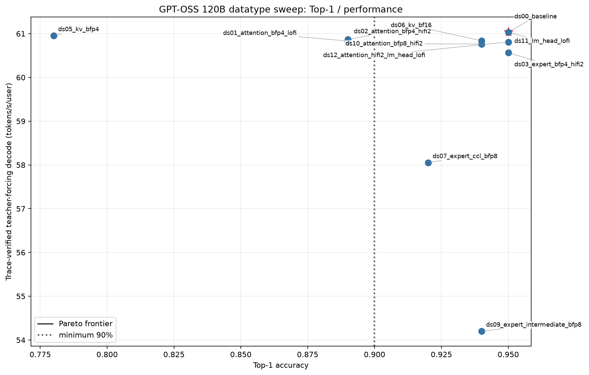
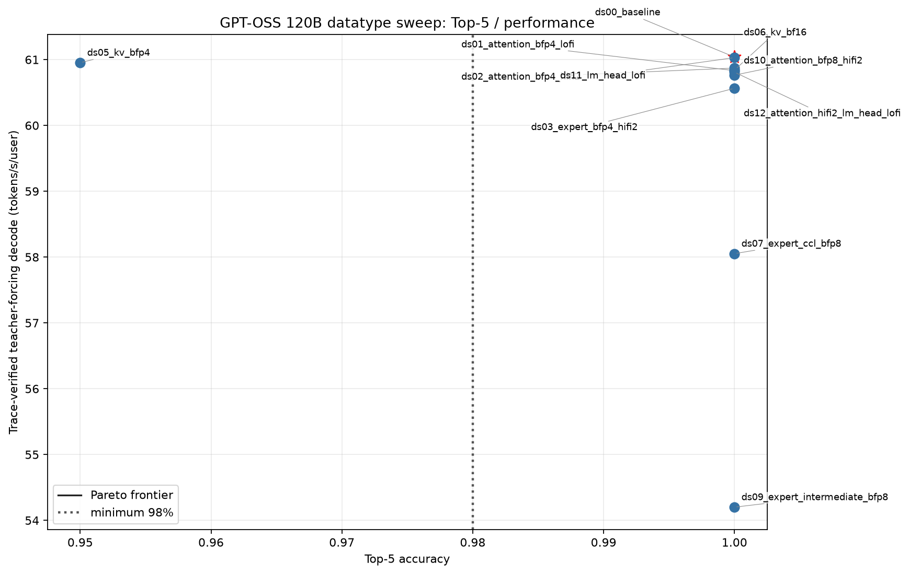

# GPT-OSS 120B datatype sweep

Status: selected and revalidated on the normal full-model construction path.

This stage evaluates full-model precision policies for `openai/gpt-oss-120b`
on the P150 family target.  It stops before vLLM integration.  The selection
gate is top-1 >= 90% and top-5 >= 98% against the main AIME24 chat-template
reference, using 100 teacher-forced/generated tokens.  Passing candidates are
ranked only by warmed, trace-verified teacher-forcing decode tokens/s/user;
eager or untraced measurements are not used.

## Selection

`ds00_baseline` is selected.  It scores top-1/top-5/top-100 of
95%/100%/100%, has a 3.6309 s teacher-forcing TTFT, and reaches
61.0382 traced teacher-forcing decode tokens/s/user (median of 60.9227 and
61.1537).  It is the fastest evaluated config that passes both gates.  The
nearest passing alternative, LM-head LoFi `ds11`, reaches 61.0300 t/s/u
(median of 61.0119 and 61.0481); the isolated and combined fidelity candidates
therefore confirm the selection rather than relying on a single timing sample.

The normal constructor loads `selected_precision_config.json` by default.
Candidate runs use `GPT_OSS_120B_DATATYPE_SWEEP_CONFIG` only to override that
path during the sweep.  `artifacts/selected/post_selection_token_out.json`
proves that the post-selection run loaded the default selected file, records
its SHA-256, and validates the constructed runtime objects.

Selected policy:

- weights: BF16 embedding/router/norm, BFP8 attention and LM head, BFP4 expert
  gate/up/down; no layer exceptions;
- fidelity: LoFi decode attention and experts, HiFi2 prefill attention/router/
  LM head, HiFi4 SDPA;
- activations: BF16 residual and expert intermediate, BFP8 attention projection
  input;
- collectives: BFP8 attention CCL, BF16 expert CCL;
- KV cache: BFP8;
- terminal path: BFP8 LM-head output/shards and BF16 sampling accumulator/device
  buffers.  There is no materialized full-logit gather: sharded TT sampling
  consumes LM-head output directly and gathers top-k values.

Runtime consumption is not inferred from JSON presence.  The loader constructs
per-layer `MultichipDecoderPolicy` objects and terminal model arguments.  The
evidence records actual weight/cache tensor dtypes, residual/projection/
intermediate dtypes, CCL casts, math-fidelity kernel configs, LM-head output,
and sampling buffers for all 36 layers.  Construction fails if any selected
field disagrees with the instantiated path.

## Candidate results

All measured rows use the same AIME24 reference revision
`b5c939de8f754692c1647ca79fbf85e8c1e70f8a`, prompt length 214, 100 tokens,
one discarded same-process warmup, trace handles captured before timing, and a
1x4 mesh.  Every ranked 99-step decode recorded exactly 99 model-trace and 99
sampling-trace submissions with zero unclassified submissions.  `ds00`,
`ds11`, and `ds12` have two timed repetitions because their performance is
close; other measured rows have one.  Hardware was four physical p300c
devices, used as the P150 semantic target.

| Config | Material change | Top-1 | Top-5 | Top-100 | TTFT ms | traced TF t/s/u | Result |
| --- | --- | ---: | ---: | ---: | ---: | ---: | --- |
| `ds00_baseline` | optimized baseline; expert BFP4+LoFi | 0.95 | 1.00 | 1.00 | 3630.94 | 61.0382 | selected/pass |
| `ds01_attention_bfp4_lofi` | attention BFP4+LoFi | 0.89 | 1.00 | 1.00 | 3639.12 | 60.8324 | fail top-1 |
| `ds02_attention_bfp4_hifi2` | attention BFP4+HiFi2 | 0.89 | 1.00 | 1.00 | 3635.06 | 60.8710 | fail top-1 |
| `ds03_expert_bfp4_hifi2` | expert BFP4+HiFi2 | 0.95 | 1.00 | 1.00 | 3599.79 | 60.5643 | pass, slower |
| `ds04_canonical_bfp8_hifi2` | canonical BFP8 experts+HiFi2 | - | - | - | - | - | physical DRAM limit |
| `ds05_kv_bfp4` | BFP4 KV cache | 0.78 | 0.95 | 1.00 | 3632.86 | 60.9527 | fail both gates |
| `ds06_kv_bf16` | BF16 KV cache | 0.94 | 1.00 | 1.00 | 3637.03 | 60.8398 | pass, slower |
| `ds07_expert_ccl_bfp8` | BFP8 expert CCL | 0.92 | 1.00 | 1.00 | 3630.68 | 58.0519 | pass, slower |
| `ds08_all_ccl_bfp4` | BFP4 attention/expert CCL | - | - | - | - | - | exact runtime blocker |
| `ds09_expert_intermediate_bfp8` | BFP8 expert intermediate | 0.94 | 1.00 | 1.00 | 3964.68 | 54.2010 | pass, slower |
| `ds10_attention_bfp8_hifi2` | isolated BFP8 attention HiFi2 | 0.94 | 1.00 | 1.00 | 3630.34 | 60.7639 | pass, slower |
| `ds11_lm_head_lofi` | isolated BFP8 LM-head LoFi | 0.95 | 1.00 | 1.00 | 3631.78 | 61.0300 | pass, slower |
| `ds12_attention_hifi2_lm_head_lofi` | combined `ds10`+`ds11` | 0.95 | 1.00 | 1.00 | 3631.03 | 60.8092 | pass, slower |

The expert BFP4 matmul group is evaluated as the required LoFi/HiFi2 pair in
`ds00`/`ds03`.  The attention BFP4 matmul group is evaluated as the same pair
in `ds01`/`ds02`.  Thus every material BFP4 matmul group considered has an
explicit BFP4+LoFi result.  `ds08` is a collective-dtype experiment rather than
a matmul group; the BFP4 residual produced at its attention-CCL boundary
reaches post-attention layernorm, where TTNN rejects it before measurement:

`Input tensor must be FLOAT32, BFLOAT16, or BFLOAT8_B, got: DataType::BFLOAT4_B`.

`ds04` cannot instantiate all 36 layers.  Its exact allocation failure requests
564,019,200 bytes while the largest free block is 59,396,864 bytes after
4,188,670,080 bytes/bank are allocated.  These two unmeasured configs are
rejected and are never placed on the Pareto frontier.

## Pareto interpretation

Both plots contain every config with full-model accuracy/performance data, a
dotted vertical minimum-accuracy line, the Pareto frontier, and the selected
point as a red star.  `ds00` dominates the evaluated set: no other measured
config has both at least its accuracy and at least its traced decode throughput.
The top-5 plot alone cannot distinguish the many 100% candidates, but the same
selected point remains fastest; the top-1 plot additionally exposes the BFP4
attention and BFP4 KV accuracy losses.

## Baseline refresh and post-selection performance

The optimized full-model baseline was refreshed with the main reference through
the normal selected-config constructor: 0.95/1.00/1.00, 3.6349 s TTFT, and a
60.8008 t/s/u median across 60.8041 and 60.7975.  The canonical optimized-full-
model artifact records the
selected config path/hash, measurement-time source tree, external readiness
runner revision/hash, pre-existing model and sampling trace handles, and exact
trace submission counts.  An earlier cold 11.6368 t/s/u artifact predated the
same-generator warmup/provenance contract and is not used for ranking or final
baseline reporting.

After selection, the normal default-selected constructor reran the optimized
warmed token-out/no-per-token-readback benchmark.  The final-source pass
records:

- non-aligned AIME24 prompt 214, 100 generated tokens: 3.6304 s TTFT and
  62.7727 decode tokens/s/user;
- prompt 128, 128 generated tokens: 0.4835 s TTFT and 62.8877 decode
  tokens/s/user;
- exact first/final token agreement with synchronous readback, 127 trace
  replays, two caller-visible scalar reads, zero full-logit reads, and zero
  steady-state host token/position/page-table refreshes;
- full-model overhead above the decoder-stack plus named terminal lower bound
  is 5.97%, passing the inherited 15% closure gate.

These token-out numbers are reported separately from teacher forcing and are
the appropriate comparison for later serving work.

## Context and non-aligned prompts

`../context_contract.json` recomputes physical capacity for every KV-cache
candidate (BFP4, BFP8, and BF16) on P150, P150x2, and P150x4.  At batch 1 and
131,072 context, per-device totals are:

| KV dtype | P150 | P150x2 | P150x4 |
| --- | ---: | ---: | ---: |
| BFP4 | 72,479,340,672 B | 38,064,149,376 B | 20,939,093,376 B |
| BFP8 | 74,895,259,776 B | 39,272,108,928 B | 21,543,073,152 B |
| BF16 | 79,425,108,096 B | 41,537,033,088 B | 22,675,535,232 B |

All three KV candidates preserve the full advertised 131,072 context on
P150x4.  The fixed resident 120B model state already exceeds 32 GiB/device on
P150 and P150x2 even before allocating useful KV capacity, so their largest
feasible context is recorded as zero; this is a hard physical DRAM limit, not
an advertised-capability reduction introduced by the selected datatype.

The selected BFP8 KV/cache path passes prompt length 214 and trace-lifecycle
isolation at non-chunk-boundary lengths 7, 8, 122, and 128.  The post-selection
artifact therefore proves that datatype plumbing did not regress non-aligned
prompt support.

## Qualitative and recovery evidence

The selected default path passes the six-prompt shared chat suite.  Prompt token
IDs match the exact-checkpoint HF controls for all six prompts.  Human review
finds on-task, correct-language, non-degenerate output; the French translation
terminates cleanly at 105 tokens, while the other evidence is bounded at 128
tokens.  Detailed structural and per-prompt findings are in
`artifacts/selected/qualitative_review.json`.

The first strict token-out attempt encountered one asynchronous endpoint
mismatch after earlier OOM and invalid-collective candidate failures.  The
AutoFix investigation found no source-level mismatch and matched an earlier
stale fabric/device-state signature.  A bounded `tt-smi` reset plus 1x4 mesh
smoke recovered the system.  The unchanged strict test then passed twice in
fresh processes, including every requested isolation length.  This recovery is
recorded as environment/device-state evidence rather than a code fix.

## Artifacts

- `sweep_results.json` and `sweep_results.csv`: complete candidate policies,
  gates, commands, regimes, metrics, status, and evidence paths;
- `selected_precision_config.json`: strict schema and runtime default;
- `candidates/*.json`: every evaluated policy;
- `artifacts/<config>/teacher_forcing_readiness.json`: measured full-model data;
- `artifacts/<config>/runtime_precision_evidence.json`: constructed dtype and
  fidelity evidence;
- `artifacts/ds04_canonical_bfp8_hifi2/failure.json` and
  `artifacts/ds08_all_ccl_bfp4/failure.json`: exact blockers;
- `artifacts/selected/post_selection_token_out.json`: selected-path token-out,
  trace, capacity, and runtime-consumption proof;
- `artifacts/selected/qualitative_tt_chat.json` and
  `artifacts/selected/qualitative_review.json`: selected qualitative evidence;
- `top1_perf_pareto.png` and `top5_perf_pareto.png`: generated pyplot charts;
- `generate_results.py`: deterministic table/plot generator;
- `stage_review.md`: fresh-context independent `clean-pass` verdict;
- `work_log.md`: exact commands, recovery chronology, verification, review,
  and commit ledger.

Limitations: only P150x4 is physically runnable for the full 120B resident
model on 32 GiB devices; P150/P150x2 results are exact capacity accounting.
On-device measurements use four physical p300c devices as the P150 semantic
target.  Most candidates have one warmed timed repetition; the selected and
two closest fidelity alternatives have two.  These are stage-selection
evidence, not a broad statistical performance study.  No vLLM code or serving
measurement is part of this stage.
