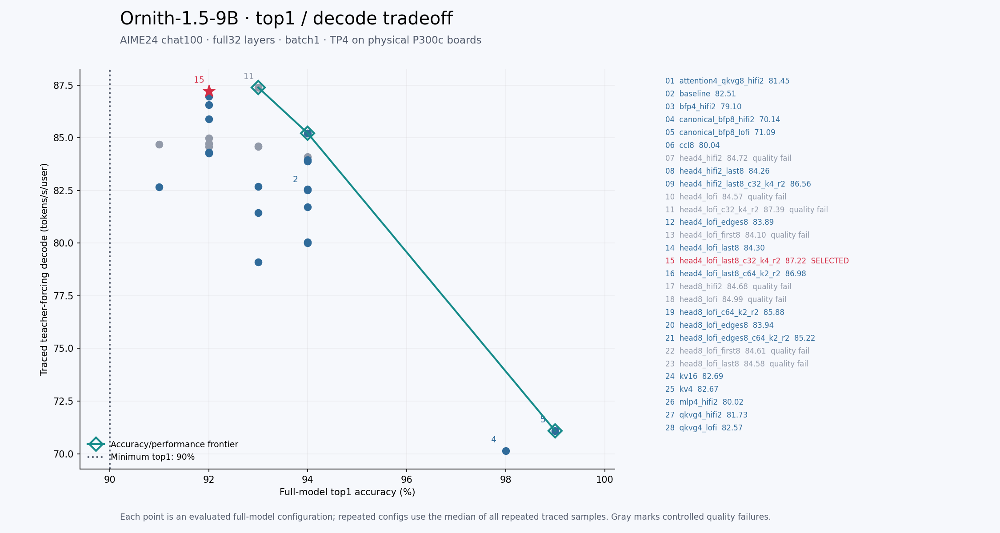
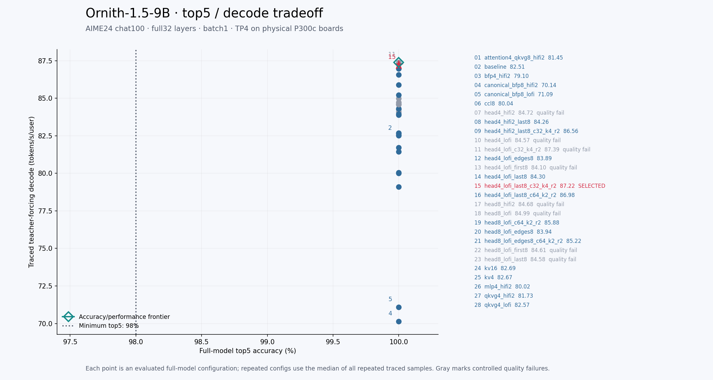

# Ornith-1.5-9B datatype sweep

Selected **head4_lofi_last8_c32_k4_r2**: full-model teacher-forcing
**92% top1 / 100% top5 / 100% top100**, **87.115 traced decode t/s/u**,
**35.52ms teacher-forcing TTFT**. Post-selection normal-default
warmed token-out: **88.037t/s/u**, **29.002ms TTFT**.
Acceptance is **top1>=90%, top5>=98%, top100=100%**, plus preserved context,
non-aligned inputs and controlled shared-suite quality. Stage review: clean-pass.

All measurements use32 layers, batch1, mesh1x4, four Blackhole chips on two
physical **P300c boards** (`p150x4` software profile). No P150 board, TP1/TP2
full-model, vLLM serving or dataset-wide AIME answer-accuracy claim is made.
The pinned model revision is489cb97981b8654bcfcf30ce1f94ed1b62e07b53.

## Selection and runtime policy

[Selected artifact](selected_precision_config.json) is consumed by default by
`OrnithModel`, `from_pretrained` and `build_generator`; explicit
`precision_config="baseline"` restores the safe optimized baseline. A missing
required selected artifact fails construction. No vLLM adapter is created in
this stage; its later construction must use this same public model/generator
entry point. Historical experiment harnesses with explicit head overrides remain
explicit baseline/candidate controls. Legacy precision files preserve the old
C64/K1/two-reader head geometry; the selected artifact records its head geometry
explicitly and runtime assertions check actual program and shard parameters.

The winner uses BFP4/LoFi body projections and head, BFP8 attention/MLP projections in layer 31, and BFP8/LoFi decode QKVG. Its head uses32 input cores, in0_block_w4 and two DRAM readers, directly consuming the32-core final norm. The paired five-run traced median is87.288t/s/u; final default reproduction is87.115, within the observed87.068..87.322 range. Across all ten repeated selected-policy samples the median is87.220t/s/u. Competing full-model rows are slower: same-geometry HiFi2 head86.564, last8 C64/K2 86.975 across its repeats, BFP8-head C64/K2 raw85.882 and edges85.221. Raw BFP4 C32/K4 is slightly faster87.391 and passes93/100/100, but its current original-template shared suite still mislabels Bonjour as informal; the selected layer31 exception corrects it. This is the fastest evaluated qualified policy. Historical K1 raw-head and first-only candidates also have concrete controlled quality rejections. Baseline repeated median is82.507t/s/u. No eager or token-out measurement enters selection.

The artifact contains every weight group, per-layer exception, compute fidelity,
activation/residual/CCL/KV/logits/sampling/state assumption and matmul flag.
`run_candidate.runtime_summary` checks every instantiated projection tensor and
kernel-config property, cache dtype, activation/residual/state, embedding/norm,
token storage and head tensor identity through common LMHead1D. Runtime logits
are checked against logits/sampling policy after traced teacher forcing. Unknown
fields and unsupported fixed-format values fail before loading weights. Layer
exceptions reject global head/norm/embedding fields and noncanonical layer keys.

| Material group | Selected dtype/fidelity | Evidence and controls |
| --- | --- | --- |
| GDN input/output, full-attention projections | BFP4/LoFi outside explicit exceptions | BaselineBFP4/LoFi versus BFP4/HiFi2, attention-onlyHiFi2, canonicalBFP8 LoFi/HiFi2 full-model rows |
| MLP gate/up and down | BFP4/LoFi outside explicit exceptions | Packed decode gate/up and separate down; all-BFP4HiFi2 and MLP-onlyHiFi2 controls |
| Decode QKVG | BFP8/LoFi | BFP4LoFi/HiFi2 and BFP8HiFi2 controls; no synthetic PCC rejection |
| LM head | Artifact-selected dtype/fidelity | BFP8LoFi/HiFi2 and BFP4LoFi/HiFi2 all measured through full model; qualitative controls retain each relevant rejection |
| Embedding/norm, residual/activation, logits/sampling | BF16 | Fixed supported interfaces validated and actual tensors recorded; no hidden full-vocabulary host sampling |
| CCL | Native producer dtype | BF16 ordinary projections, explicit FP32 GDN producer outputs; BFP8 cast/transfer/restore candidate passes accuracy but is slower |
| KV / recurrent / token history | BFP8 / FP32 / UINT32 | Actual allocations and selected context probe; native paged-fill/update semantics retained |

This is a dense hybrid model, with24 linear-attention and8 full-attention layers;
MoE routing/expert dtype policies do not apply. Recurrent and attention internal
accumulation remain the validated predecessor policy; the swept fidelities apply
to the material weight projection groups named above.

## Accuracy and performance regimes

[Reference provenance](reference_provenance.json) verifies the main AIME24 chat
reference:161 prompt tokens,100 HF-generated reference tokens, original upstream
template, exact snapshot and reference hashes. [Original baseline refresh](baseline_teacher_v1.json)
returns94/100/100,82.70t/s/u and789.13ms cold-request TTFT. The integrated baseline
also refreshes prefill95/100/100 and teacher94/100/100. These percentages measure
reference token ranking over100 positions, not mathematical answers across AIME.

Sweep ranking uses the unchanged common readiness teacher-forcing callback path
with traced model decode and explicit token/logit readback. Each run records
99 decode replays and full100-position coverage. Prefill readiness precedes the
teacher run; later repeats reuse warm traces. TTFT includes request/capture state
and is labeled per artifact. It must not be compared to warmed token-out TTFT.
Main accuracy/teacher runs allocate context2048 while keeping model max_context
262144; the advertised capability is independently validated at native context.
No eager teacher-forcing number enters selection or either chart.

Token-out uses the exact optimized-full-model benchmark: native262144 cache,
prompt128/generate128, five warmed requests and three127-step plain no-readback
replay windows. The main token-out number is median plain throughput; TTFT is
median warmed request TTFT. All counters exclude per-token host input refresh,
readbacks and waits; two synchronization boundaries and one later validation read
are separately recorded. [Post-selection benchmark](post_selection_tokenout_v2.json)
loads the selected artifact through the normal default construction path. Later
reports and vLLM comparisons should use this **post-selection token-out** number.

[Matched token-out controls](work_log.md) resolve the prior isolated-terminal
BFP4/BFP8 ordering: at the historical C64/K1 full-model geometry BFP8/LoFi was
slightly faster in both traced teacher forcing and token-out. The revised
selected BFP4/C32/K4 geometry is faster in the current full-model comparisons. Lower weight storage alone
does not establish a speed improvement. Close finalists are repeated, and
selection uses their median traced teacher-forcing throughput.

## Precision-specific head geometry

Independent review found that the previous BF16 weight-buffer L1 rejection did
not apply to the smaller BFP4 tiles. [AutoFix geometry investigation](AUTOFIX_head_geometry.md)
and [complete geometry results](head_geometry_results.json) and [matrix report](head_geometry_README.md) record all 27 legal
core/block/reader combinations: 19 execute, one fails a controlled runtime
allocation test, and seven exceed exact source-derived L1 bounds. Every tested
head uses actual pinned model weights and a saved real model activation,
BFP4/LoFi with BF16 input/output and FP32 accumulation. Three-reader candidates
include adapted weight padding and output slicing. Local head timings only order
full-model candidates; all Pareto points and selection use traced teacher forcing.

C16/K1/one-reader fails identically with paired and serial traces. The allocated
normalized input, 16-core input and two common-head output buffers explain the
exact collision. This is a measured allocation limit for that tested contract,
not a stale BF16 or synthetic-accuracy rejection. [Rejection receipts](geometry_rejections.json)
retain raw failure/control hashes. The selected geometry then receives a new
normal-default token-out, context/tracker and qualitative validation. Earlier K1
post-selection numbers remain historical controls and are superseded by the
headline benchmark above. Geometry variants have distinct IDs in the table and
charts; their timings are never pooled across geometries.

## Full-model results and Pareto frontier

Every evaluated full-model config appears; repeated configurations use their
median across all repeated traced samples (including final reproduction). The green frontier is the non-dominated accuracy/
throughput set, red marks the selected config, and the dotted line is the minimum
accuracy. All top5 values are100%, so that frontier degenerates to one point.
Gray points have a controlled qualitative rejection. The accuracy-only frontier
can include such a point; passing numeric gates alone does not repair visible
model-quality regressions. Full results and policies are in
[sweep_results.json](sweep_results.json) and [CSV](sweep_results.csv).

| Run | Top1 | Top5 | Top100 | Traced TF t/s/u | TF TTFT ms | Gate / quality |
| --- | ---: | ---: | ---: | ---: | ---: | --- |
| [attention4_qkvg8_hifi2_v1](attention4_qkvg8_hifi2_v1.json) | 93% | 100% | 100% | 81.452 | 378.14 | pass; quality not_evaluated |
| [baseline_repeat5_v2](baseline_bfp4_lofi_qkvg8_lofi_head16_hifi4_repeat5_v2.json) | 94% | 100% | 100% | 82.507 | 35.73 | pass; quality not_evaluated |
| [baseline_full_v1](baseline_full_v1.json) | 94% | 100% | 100% | 82.472 | 388.04 | pass; quality not_evaluated |
| [bfp4_hifi2_v1](bfp4_hifi2_v1.json) | 93% | 100% | 100% | 79.096 | 2314.39 | pass; quality not_evaluated |
| [canonical_bfp8_hifi2_v1](canonical_bfp8_hifi2_v1.json) | 98% | 100% | 100% | 70.135 | 2312.73 | pass; quality not_evaluated |
| [canonical_bfp8_lofi_v1](canonical_bfp8_lofi_v1.json) | 99% | 100% | 100% | 71.086 | 2535.89 | pass; quality not_evaluated |
| [ccl8_v1](ccl8_v1.json) | 94% | 100% | 100% | 80.040 | 395.32 | pass; quality not_evaluated |
| [head4_hifi2_last8_c32_k4_r2_repeat5_v3](head4_hifi2_last8_c32_k4_r2_repeat5_v3.json) | 92% | 100% | 100% | 86.564 | 35.21 | pass; quality not_evaluated |
| [head4_hifi2_last8_repeat5_v2](head4_hifi2_last8_repeat5_v2.json) | 92% | 100% | 100% | 84.262 | 388.60 | pass; quality pass |
| [head4_hifi2_v1](head4_hifi2_v1.json) | 92% | 100% | 100% | 84.724 | 384.09 | pass; quality fail |
| [head4_lofi_c32_k4_r2_repeat5_v3](head4_lofi_c32_k4_r2_repeat5_v3.json) | 93% | 100% | 100% | 87.391 | 376.39 | pass; quality fail |
| [head4_lofi_edges8_repeat5_v2](head4_lofi_edges8_repeat5_v2.json) | 94% | 100% | 100% | 83.894 | 36.05 | pass; quality pass |
| [head4_lofi_edges8_v1](head4_lofi_edges8_v1.json) | 94% | 100% | 100% | 84.137 | 391.79 | pass; quality pass |
| [head4_lofi_first8_v1](head4_lofi_first8_v1.json) | 94% | 100% | 100% | 84.103 | 388.55 | pass; quality fail |
| [head4_lofi_last8_c32_k4_r2_repeat5_v3](head4_lofi_last8_c32_k4_r2_repeat5_v3.json) | 92% | 100% | 100% | 87.288 | 385.66 | pass; quality pass |
| [head4_lofi_last8_c64_k2_r2_repeat5_v3](head4_lofi_last8_c64_k2_r2_repeat5_v3.json) | 92% | 100% | 100% | 86.982 | 35.05 | pass; quality not_evaluated |
| [head4_lofi_last8_repeat5_v2](head4_lofi_last8_repeat5_v2.json) | 92% | 100% | 100% | 84.371 | 387.72 | pass; quality pass |
| [head4_lofi_last8_v1](head4_lofi_last8_v1.json) | 92% | 100% | 100% | 84.523 | 396.04 | pass; quality pass |
| [head4_lofi_v1](head4_lofi_v1.json) | 92% | 100% | 100% | 84.574 | 380.99 | pass; quality fail |
| [head8_hifi2_v1](head8_hifi2_v1.json) | 91% | 100% | 100% | 84.684 | 384.03 | pass; quality fail |
| [head8_lofi_c64_k2_r2_repeat5_v3](head8_lofi_c64_k2_r2_repeat5_v3.json) | 92% | 100% | 100% | 85.882 | 35.72 | pass; quality not_evaluated |
| [head8_lofi_edges8_c64_k2_r2_repeat5_v3](head8_lofi_edges8_c64_k2_r2_repeat5_v3.json) | 94% | 100% | 100% | 85.221 | 35.38 | pass; quality not_evaluated |
| [head8_lofi_edges8_repeat5_v2](head8_lofi_edges8_repeat5_v2.json) | 94% | 100% | 100% | 83.943 | 36.40 | pass; quality pass |
| [head8_lofi_edges8_v1](head8_lofi_edges8_v1.json) | 94% | 100% | 100% | 83.961 | 391.74 | pass; quality pass |
| [head8_lofi_first8_v1](head8_lofi_first8_v1.json) | 93% | 100% | 100% | 84.607 | 387.70 | pass; quality fail |
| [head8_lofi_last8_v1](head8_lofi_last8_v1.json) | 93% | 100% | 100% | 84.576 | 386.42 | pass; quality fail |
| [head8_lofi_v1](head8_lofi_v1.json) | 92% | 100% | 100% | 84.994 | 390.24 | pass; quality fail |
| [kv16_v1](kv16_v1.json) | 93% | 100% | 100% | 82.691 | 378.70 | pass; quality not_evaluated |
| [kv4_v1](kv4_v1.json) | 91% | 100% | 100% | 82.672 | 381.58 | pass; quality not_evaluated |
| [mlp4_hifi2_v1](mlp4_hifi2_v1.json) | 94% | 100% | 100% | 80.017 | 384.06 | pass; quality not_evaluated |
| [qkvg4_hifi2_v1](qkvg4_hifi2_v1.json) | 94% | 100% | 100% | 81.726 | 386.97 | pass; quality not_evaluated |
| [qkvg4_lofi_v1](qkvg4_lofi_v1.json) | 94% | 100% | 100% | 82.570 | 376.71 | pass; quality not_evaluated |
| [selected_default_repeat5_v1](selected_default_repeat5_v1.json) | 92% | 100% | 100% | 84.246 | 386.69 | pass; quality pass |
| [selected_default_repeat5_v2](selected_default_repeat5_v2.json) | 92% | 100% | 100% | 87.115 | 35.52 | pass; quality pass |
| [selected_geometry_k2_teacher_v1](selected_geometry_k2_teacher_v1.json) | 92% | 100% | 100% | 86.903 | 35.09 | pass; quality not_evaluated |

## Capability, qualitative review and verification

[Context contract](../context_contract.json) is recomputed for selected precision
with unchanged262144 native context. [KV capacity calculations](context_candidates.json)
include BF16/BFP8/BFP4 tile overheads; none requires a DRAM-driven reduction.
[Selected native execution](selected_native_v2.json) validates prefill262143
and262144, last-position decode advancing to262144, and resident131/2048 prefill
traces with measured DRAM/L1/TRACE allocations. Logical non-aligned inputs remain
supported. Batch1 native capacity is established;32 simultaneous native-length
requests and million-token YaRN execution are not claimed by this stage.

[AutoFix precision investigation](AUTOFIX_french.md) records the raw reduced-head
French error, exact HF controls, rejected prompt/stale-policy hypotheses, and
the measured correction. [Selected qualitative review](qualitative_selected_v2/QUALITATIVE_REVIEW.md)
inspects the shared six chat prompts plus AIME against pinned HF controls.
These are bounded128/100-token qualitative checks, not completed-answer or code
execution claims. Longer controls resolve any suspicious cutoff fragments.

The source snapshots and exact commands, environment, branch/commit, binary/log
hashes and exit statuses are under `logs/*.provenance.json`; compact raw source
snapshots are retained as `.sources.json.gz`. Device commands were serialized.
No reset, lock clearing or recovery was needed. Hardware/model advisories are
classified in the work log; HF CPU fallback is reference-only. Selected trace
allocation checks and the current32-request Watcher/trace-tracker check validate
the relevant buffer lifecycle. Startup clocks report1337MHz in final timings and
1343MHz in the baseline token-out run under the same1350MHz request policy;
results are measured and unadjusted, not clock-normalized. Timed-window clock
samples are not claimed.

Python-only runtime changes need no C++ build. Applicable pre-commit hooks and
host policy/generator/trace tests pass. [Independent review](STAGE_REVIEW.md)
and [work log](work_log.md) record the final gates and local commit receipts.
No vLLM integration, push or publication is performed.
